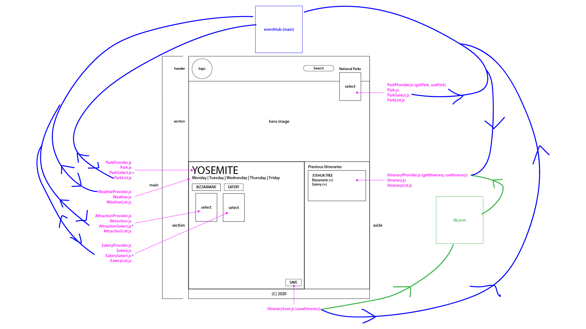

# Holiday Road Jungle Books

Jungle booking is an itinerary building application.  The user can create new itineraries by picking a park, an eatery, and an attraction.  The app connects to several APIs in order to function.  The parks that the user chooses from are fetched from the National Park Services API.  Each time a park is selected, the weather forecast for that park is displayed.  The weather is fetched from [openweathermap.org](https://openweathermap.org/api).  The user then needs to select an attraction and an eatery.  The data for both of these are fetched from APIs created by the Nashville Software School, which are listed below.  When an itinerary is saved it is posted to a local json database.  The data from that local database is fetched, and all the saved itineraries are displayed to the DOM. 

# Group Project
## Goals of Project:
* Build the Itinerary -> list all national parks in a dropdown, when a user chooses one, display the name of the park in the Itinerary Preview section. Bizarraries & Eateries should also have dropdowns to add data to itinerary preview section. 
* Build the Itinerary Preview section -> there should be a button labeled Save Itinerary. When the user has selected a park, and the name of the park has been added to the Itinerary Preview section, query the Open Weather API and display the 5 day forecast for that location. This will allow the user to see if they want to make the trip soon.  When the user adds any item to the Itinerary Preview, there should be a Details button next to the name of the item. When the user clicks on any detail button for an itinerary item, a dialog box should be presented to the user with more information about that item (description, address, etc...).
* Save the Itinerary -> Once the user has selected a park, a bizarre attraction, and an eatery, the Save Itinerary button should be enabled. When the user clicks the Save Itinerary button, the chosen items should be saved as an object in your own, local API that is managed by json-server. Each saved itinerary should appear in an aside bar on the right side of the UI.

## My Contributions to the Project: 
* I wrote all code in `itinerary` folder of project. 
* Created custom event to save itinerary once all 3 required selections are made by the user. Once button is clicked, the information is saved into the local database & appears in the sidebar of webpage. 
* In the sidebar section, user can click a number of different links to show more information about the options they selected. 
* Wrote Aside.css file to style sidebar section of webpage with help from team in deciding overall look of webpage. As a team, we decided to focus more on completing JavaScript/API stretchgoals rather than spend time styling the webpage further in order to further our learning during the project time-frame. 
* Worked closely with my team from start to finish during this project. On day one we began with a wireframe showing data flow (see img below) & continued to check-in regularly to assist one another in connecting each API where needed. 

## Contributors: 
* Cornelia (CJ) Johnson - worked with the Weather API to display 5 day forecast once a park is selected from park dropdown. Implemented Hero Image to show photograph of chosen park on webpage once selected. https://www.linkedin.com/in/corneliajohnson/
* Aaron Gertler - worked with Bizarraries & Eateries API to create dropdown menus in preview section of webpage. Contributed majority of styling advice, designed logo & led the team in understanding key user experience components https://www.linkedin.com/in/asgertler/
* Brady Logan - worked with the Parks API to display parks in dropdown. Implemented filter of parks based on state & activity chosen in order to signifigantly reduce page load time. https://www.linkedin.com/in/brady-logan-295559150/

# Important Information
## Required Tools
* JSON SERVER - You will need to have json server installed and run the following command in the api folder `json-server -p 8088 -w db.json`
* API Keys - Register in the following APIs in order to get a key (which is required to fetch their data)
1. https://www.nps.gov/subjects/digital/nps-data-api.htm
1. https://openweathermap.org/api

## Settings

After each teammate clone the repository, each must perform the following steps.
..
1. In the `scripts` directory, you will see a file named `.Settings.js` (note the dot at the beginning).
1. Copy that file with `cp .Settings.js Settings.js`. The `Settings.js` file is already in the `.gitignore` file, so it won't ever be tracked by git.
1. Register an API key for the APIs below that need it.
1. Copy your key into the appropriate place in the `Settings.js` file.

## APIs

### National Park Service API

* API home: https://www.nps.gov/subjects/digital/nps-data-api.htm
* API documentation: https://www.nps.gov/subjects/developer/api-documentation.htm

#### List All Parks

https://developer.nps.gov/api/v1/parks?api_key=your_api_key

### Weather API

https://openweathermap.org/api

### Bizarre Destination

http://holidayroad.nss.team/bizarreries

### Eateries Destination

http://holidayroad.nss.team/eateries

## Our Client Persona

### Brittany

## Wireframe
